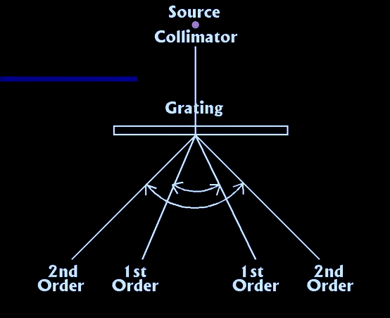
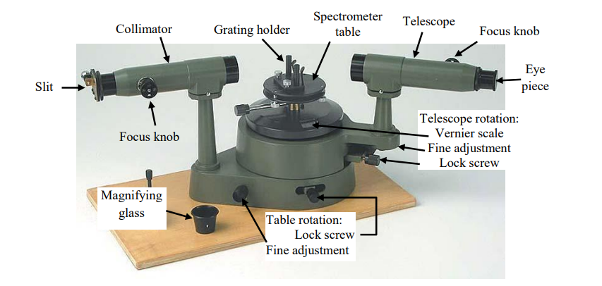

Diffraction grating is a thin film of clear glass or plastic that has a large number of lines per (mm) drawn on it. A typical grating has density of 250 lines/mm. Using more expensive laser techniques, it is possible to create line densities of 3000 lines/mm or higher. When light from a bright and small source passes through a diffraction grating, it generates a large number of sources at the grating. The very thin space between every two adjacent lines of the grating becomes an independent source. These sources are coherent sources meaning that they emit in phase waves with the same wavelength. These sources act independently such that each source sends out waves in all directions. As shown in Fig. 1, on a screen a distance D away, points can be found whose distance differences from these sources are different multiples of λ causing bright fringes. One difference between the interference of many slits (diffraction grating) and double slit experiment is that a diffraction grating makes a number of principle maxima along with lower intensity maxima in between. The principal maxima occur on both sides of the central maximum for which a formula similar to double slit interference holds true which is given by   

dSinθ = nλ

 
where n = 1, 2, 3, ……….
  

In this equation, d is the spacing between every two lines (same as every two sources). If there are N lines per mm of the grating, then d, the space between every two adjacent lines or (every two adjacent sources) is d=1/N(mm)
Based on Eq. 1, if the light source has different colors (different wavelengths), shorter wavelength color will have smaller diffraction angle compared to longer wavelength for the same order of principle maximum. Thus we will see a spectrum in such case. The angular spacing for different colors will increase for higher order maxima.  
 

<h4>Apparatus</h4>
Spectrometer, grating and holder, mercury arc lamp, sodium lamp (optional), various discharge tubes and accessories, table lamp.
 

<h4>Description of Apparatus</h4>
Spectrometer has application in a wide range of areas including to determine the constituents of stars, to investigate the structure of the atom. You will using a simple but high precision student spectrometer similar to the picture shown in Fig. 2, which consists of three basic components; acollimator, a diffraction grating, and a telescope.

Light enters through a narrow slit positioned at the focal point of the collimating lens. The light leaving the collimator is therefore a thin, parallel beam, which ensures that all the light from the slit strikes the diffraction grating at the same angle of incidence. The grating diffracts the light of different color light at different angles. The telescope is focused at infinity to collect the parallel diffracted beam of light and can be rotated at very precisely measured angles. There are two Vernier readings on two opposite sides on the table, Vernier A and B. You can treat these two reading as measured by two different scales. The Vernier reading has least count of 1’ [(1/60)o]. To aid viewing the Vernier scale reading a magnifying glass is provided. The table and the telescope can be fine adjusted by tightening the lock screw and rotating the fine adjustment knobs.
The Diffraction Grating is a delicate component. It has a large number of lines per (mm) drawn on it. Be careful not to touch or scratch the surface of the grating.
